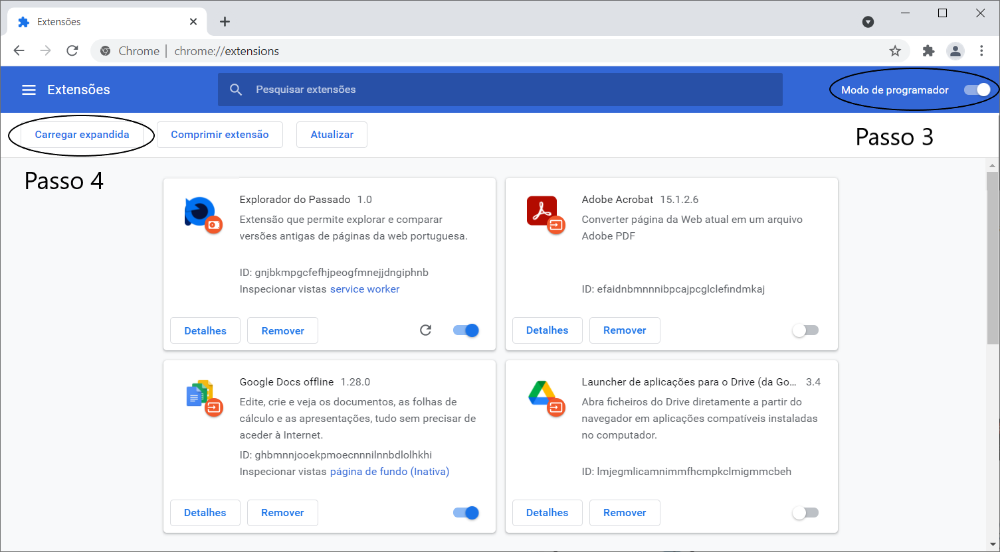
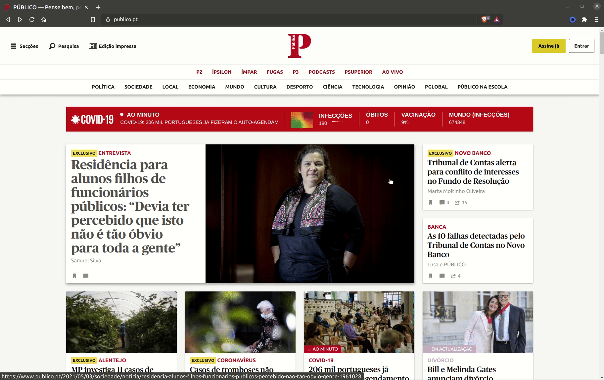
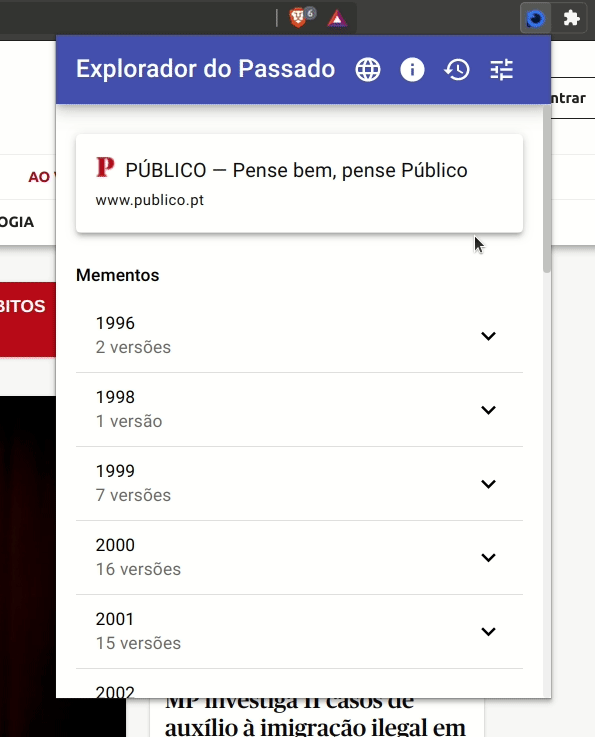

O Explorador do Passado é uma extensão para browsers baseados em Chromium que permite encontrar e comparar versões mais antigas de páginas da web portuguesa. 

Permite pesquisar estas versões (mementos) a partir da página atual e compará-las em vista lado a lado ou de diferenças de texto, entre outras ações e funcionalidades.

### Instalação

1. Fazer o [download](https://github.com/rafaavc/explorador-do-passado/releases/download/v1.0/explorador-do-passado-v1.0.zip) da extensão e extrair o conteúdo do ficheiro com extensão ".zip" no diretório desejado

2. Navegar até à página de extensões do navegador (pode, em princípio, ser acedida através da inserção de "chrome://extensions" na barra de pesquisa)

3. Ativar o modo de programador

4. Clicar em "Carregar expandida" e procurar e selecionar a pasta "explorador-do-passado" (que foi extraída no passo 1)

Após a execução destes passos a extensão deve estar instalada no navegador.

## Ações do memento

Após encontrar um memento existem quatro opções:
- Abrir em vista lado a lado (com a página atual)
- Abrir em vista de diferenças de testo (com a página atual)
- Abrir num novo separador
- Copiar o seu URL
### Vista lado a lado

A vista lado a lado permite comparar visualmente o memento com a página atual.

A vista lado a lado apresenta também um cartão flutuante no canto inferior direito que permite executar todas as outras ações possíveis do memento, bem como fechar a sua visualização, sem precisar de abrir a extensão.

### Vista de diferenças de texto

A vista de diferenças de texto permite comparar ver que alterações foram efetuadas ao texto desde o memento.

A vista de diferenças de texto apresenta também um cartão flutuante no canto inferior direito que permite executar todas as outras ações possíveis do memento, bem como fechar a sua visualização, sem precisar de abrir a extensão.

## Histórico

O histórico permite revisitar mementos.

## Definições

Nas definições podem-se alterar os seguintes parâmetros:
    <ul>
        <li>Linguagem: Português ou Inglês</li>
        <li>Número máximo de entradas no histórico</li>
        <li>Obter informação ao carregar página: se estiver ativa, sempre que uma página é visitada a extensão carrega imediatamente a informação sobre a mesma; se não estiver ativa esse carregamento acontece apenas quando a extensão for aberta.</li>
    </ul>

## Estados do ícone da extensão

### A carregar

A extensão encontra-se no processo de obter informação sobre a página atual.

### Nenhum memento encontrado

A extensão terminou o processo de obtenção de informação mas não encontrou versões antigas da página atual.

### Mementos disponíveis

A extensão terminou o processo de obtenção de informação e encontrou versões antigas da página atual.
